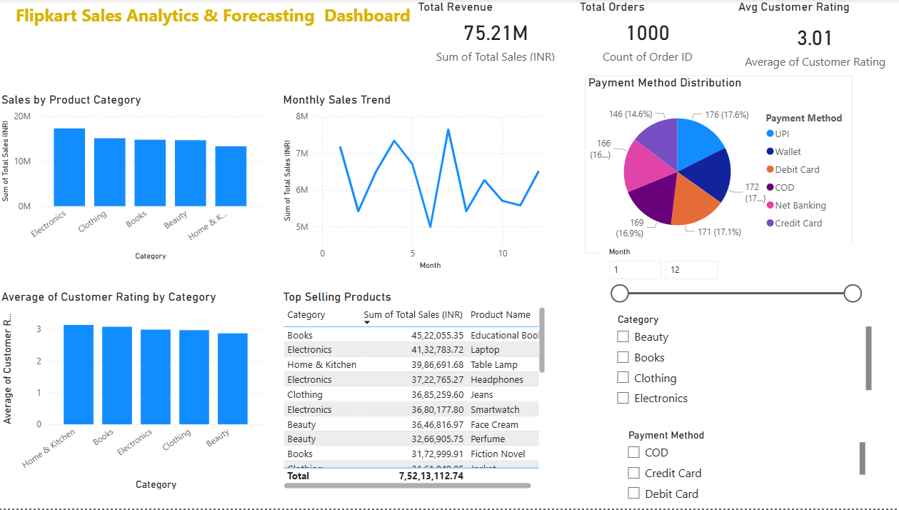

# Flipkart Sales Analytics & Forecasting Dashboard

This project analyzes Flipkart sales data to identify product trends, customer behavior, and revenue insights. It demonstrates an end-to-end data analytics workflow using Python, MySQL, and Power BI.

---

## Tools Used

- Python (Pandas, NumPy, Scikit-learn, Matplotlib)
- MySQL
- Power BI
- Excel

---

## Project Workflow

1. Data cleaning and preprocessing using Python.
2. Exploratory Data Analysis to identify sales trends.
3. Sales forecasting using Machine Learning models.
4. Storing and querying data using MySQL.
5. Building an interactive Power BI dashboard for visualization.

---

## Key Insights

- Electronics category generated the highest revenue.
- Monthly sales trends fluctuate across the year.
- UPI and Wallet are the most commonly used payment methods.
- Customer ratings vary across product categories.

---

## Dashboard Preview

---

## Project Files

- `flipkart_sales_forecasting.ipynb` → Python analysis and forecasting
- `flipkart_sales.csv` → Original dataset
- `clean_flipkart_sales.csv` → Cleaned dataset
- `sales_predictions.csv` → Model predictions
- `flipkart_sales_analytics_dashboard.pbix` → Power BI dashboard